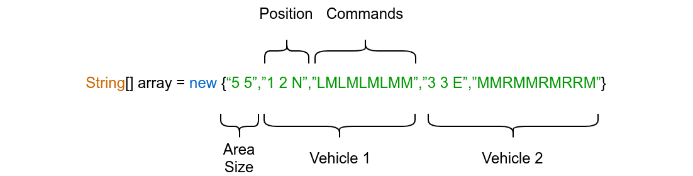

# Code Review: Autonomous Vehicle Control

This study was prepared with java language in accordance with OOP and SOLID software development principles.

## 1. Task Description 

You are part of a test team to be carried out for an autonomous vehicle is produced by XYZ firm. **Your task** is as below.

- To send the given coordinate and direction parameters to the vehicles.
- Providing the vehicle move
- Getting the last coordinate and direction parameters from the vehicles

## 1.1. The Area

The area where the vehicle will move is divided into a grid to simplify navigation.

## 1.2. Vehicle Position

The position of the vehicle on this area is represented by the x and y coordinates and a letter representing one of the four cardinal points. An example position could be (0, 0, N). This means the vehicle is in the lower left corner on the grid area and has North (N North) direction.

## 1.3. Vehicle Controlling

To control the vehicle, the control center sends a simple letter. These letters are 'L', 'R' and 'M'.
- 'L' and 'R' allow the vehicle to rotate 90 degrees left or right.
- 'M' provides to go one unit forward.

## 1.4. Input Data

**Attention!** Each vehicle must move in turn. After one vehicle has finished moving, the second vehicle must move.

- The first element of the array “5 5” is the (x,y) dimension of the vehicle's motion area.
- The second element of the array “1 2 N” is the first position given to you in the movement area of the vehicle 1.
- The third element of the sequence “LMLMLMLMM” is the directions that will enable the movement of the vehicle 1.
- The fourth element of the array “3 3 E” is the first position given to you in the movement area of the vehicle 2.
- The fifth element of the array “MMRMMRMRRM” is the directions that will enable the movement of the vehicle 2.

## 1.5. Output (Result)

Expected Output based on example inputs:
{“1 3 N”,”5 1 E”}